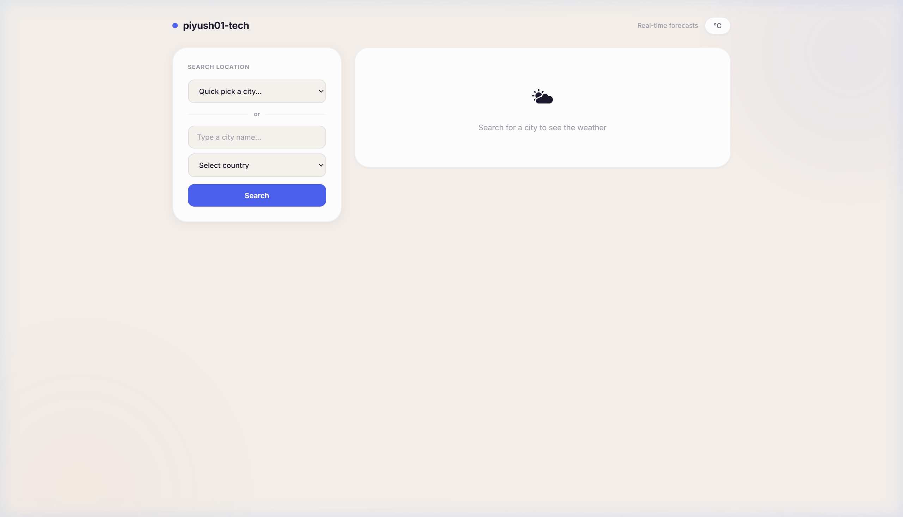
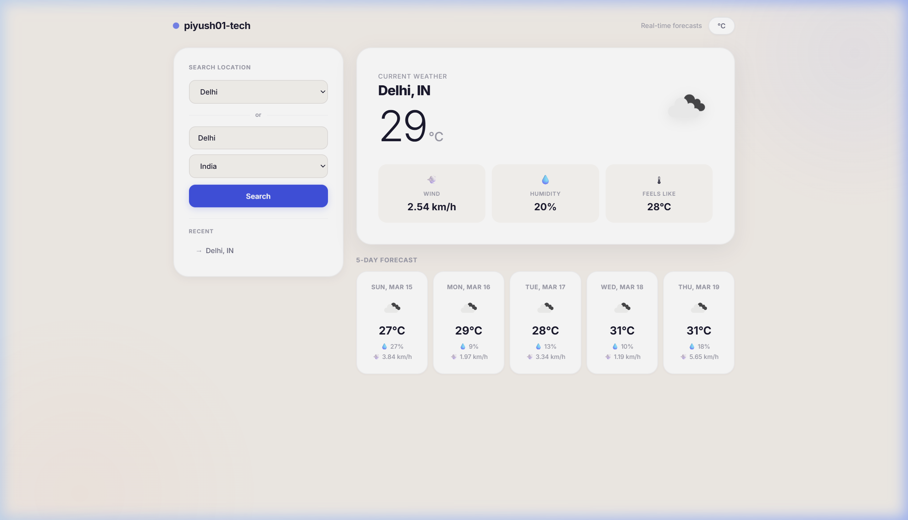

# piyush01-tech — Weather Dashboard

## [🔗 Live Website](https://piyush01-tech.github.io/WEATHER-DASHBOARD/)

A simple weather app. Pick a city, see the weather.

## What it does

- Pick a city from the dropdown or type one in
- Get current weather — temperature, wind, humidity, feels-like
- See a 5-day forecast at a glance
- Switch between °C and °F
- Recent searches are saved

## Screenshots

|  |  |
|---|---|

## Built with

- HTML, CSS, JavaScript
- Node.js + Express
- [OpenWeatherMap API](https://openweathermap.org/api)

## Author

**[@Piyush01-tech](https://github.com/Piyush01-tech)**
